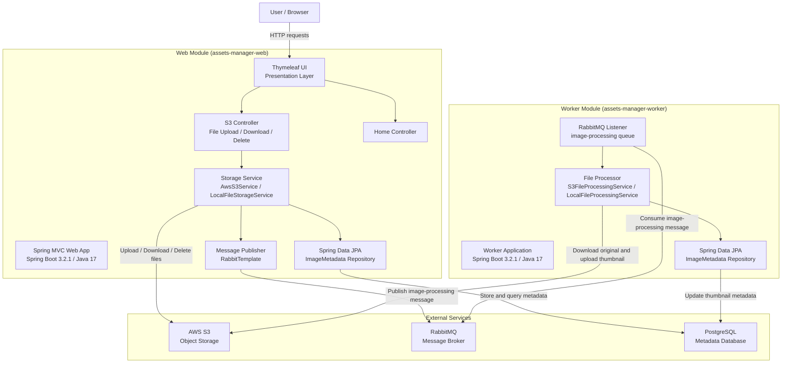

# Application Architecture Diagram

## Assets Manager - Architecture Overview

## Technology Stack

| Layer | Technology |
|-------|-----------|
| Language | Java 17 |
| Framework | Spring Boot 3.2.1 |
| Presentation | Spring MVC, Thymeleaf |
| Messaging | Spring AMQP, RabbitMQ |
| Object Storage | AWS SDK 2.25.13, Amazon S3 |
| Data Access | Spring Data JPA, Hibernate |
| Database | PostgreSQL (production), H2 (testing) |
| Serialization | Jackson (JSON) |
| Build Tool | Maven |

## Module Descriptions

### Web Module (`assets-manager-web`)
Handles HTTP requests for file uploads, listing, viewing, and deletion. Stores files in AWS S3, persists metadata in PostgreSQL, and publishes image-processing messages to RabbitMQ after each upload. Supports a local file storage profile (`dev`) for development.

### Worker Module (`assets-manager-worker`)
Consumes image-processing messages from RabbitMQ. Downloads the original image from AWS S3, generates a thumbnail, uploads the thumbnail back to S3, and updates the image metadata in PostgreSQL.

## External Dependencies

| Service | Purpose |
|---------|---------|
| AWS S3 | Stores original uploaded files and generated thumbnails |
| RabbitMQ | Decouples upload (web) from thumbnail generation (worker) via `image-processing` queue |
| PostgreSQL | Persists file metadata including S3 keys, URLs, and thumbnail references |
