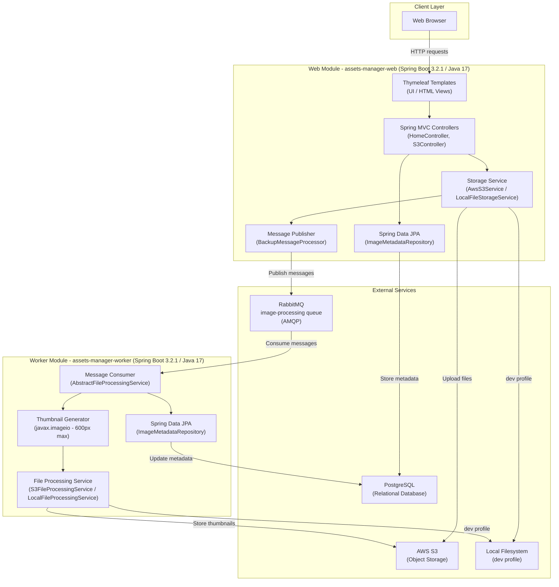

# Asset Manager - Architecture Diagram

## Architecture Overview

The **Asset Manager** is a Spring Boot multi-module Java application with two independently deployable services:

### Modules

| Module | Purpose | Port |
|--------|---------|------|
| `assets-manager-web` | Handles file uploads, listing, viewing, and deletion | 8080 |
| `assets-manager-worker` | Asynchronously processes images and generates thumbnails | 8081 |

### Technology Stack

| Layer | Technology |
|-------|-----------|
| Language | Java 17 |
| Framework | Spring Boot 3.2.1 |
| Web UI | Thymeleaf |
| Messaging | Spring AMQP / RabbitMQ |
| Storage | AWS S3 (SDK v2.25.13) |
| Database | PostgreSQL (JPA/Hibernate) |
| Image Processing | javax.imageio |
| Code Generation | Lombok |

### Key Data Flows

1. **File Upload**: Browser → Web Controller → Storage Service → AWS S3 + PostgreSQL → RabbitMQ message published
2. **Thumbnail Generation**: RabbitMQ message consumed → Worker → Download from S3 → Generate thumbnail (600px max) → Upload thumbnail to S3 → Update PostgreSQL
3. **File Viewing**: Browser → Web Controller → Storage Service → Retrieve from S3 → Stream to browser

### External Dependencies

- **AWS S3**: Primary object storage for uploaded files and generated thumbnails
- **RabbitMQ**: Message broker for decoupling upload (web) from processing (worker)
- **PostgreSQL**: Relational database for file metadata (`ImageMetadata` entity)
- **Local Filesystem**: Used as a fallback in `dev` Spring profile

### Deployment Profiles

- **Default**: Uses AWS S3 for storage
- **`dev` profile**: Uses local filesystem instead of S3
- **`backup` profile**: Activates additional message monitoring consumer in web module
